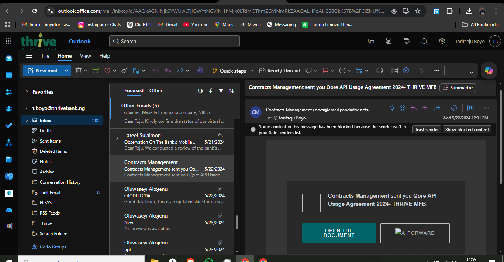
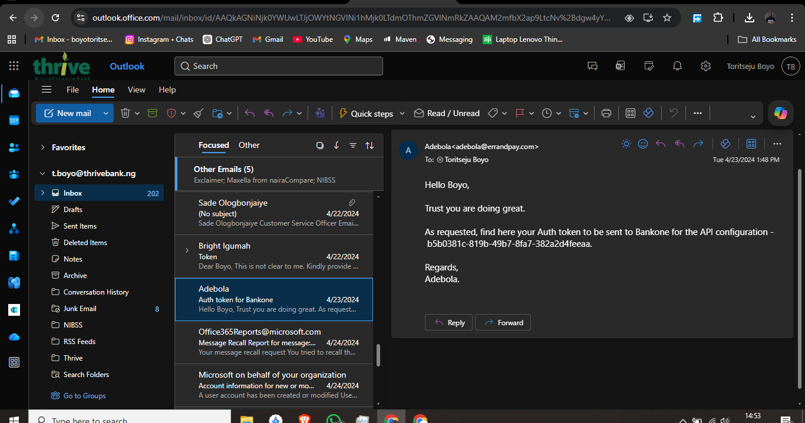
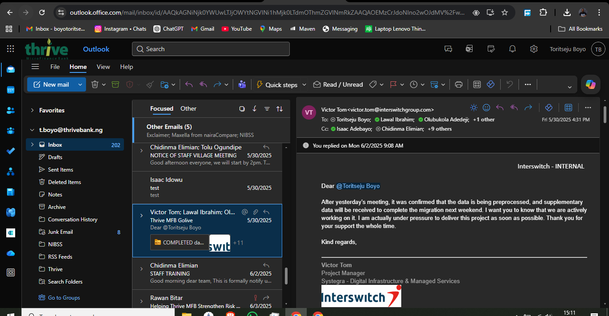
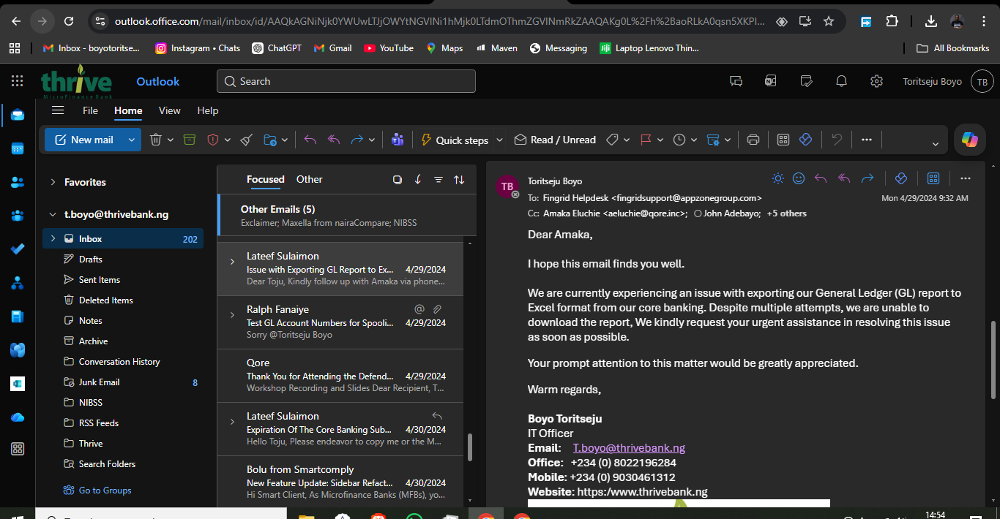
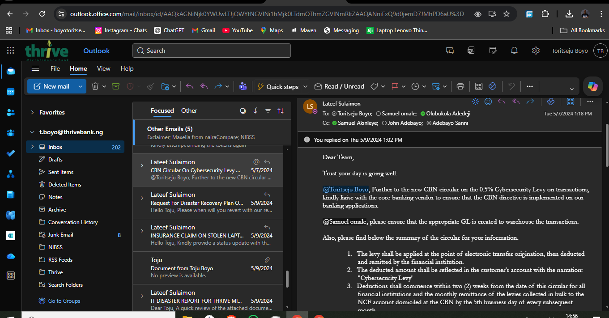
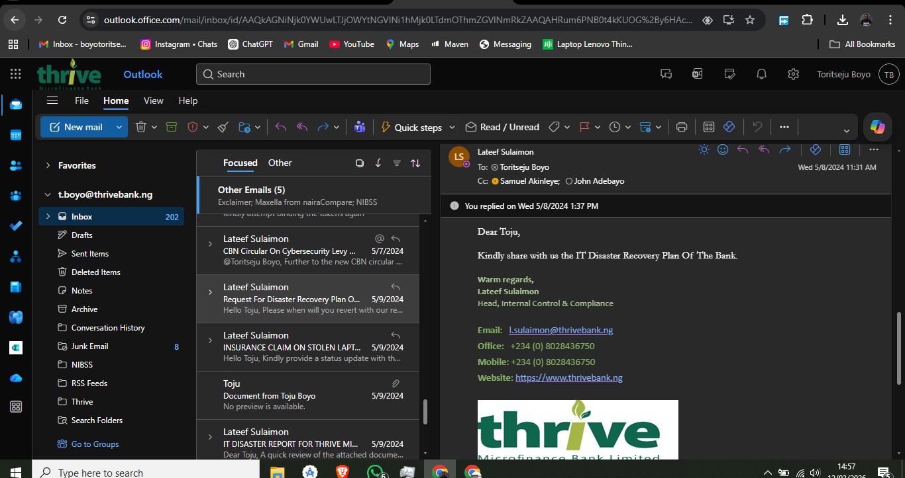
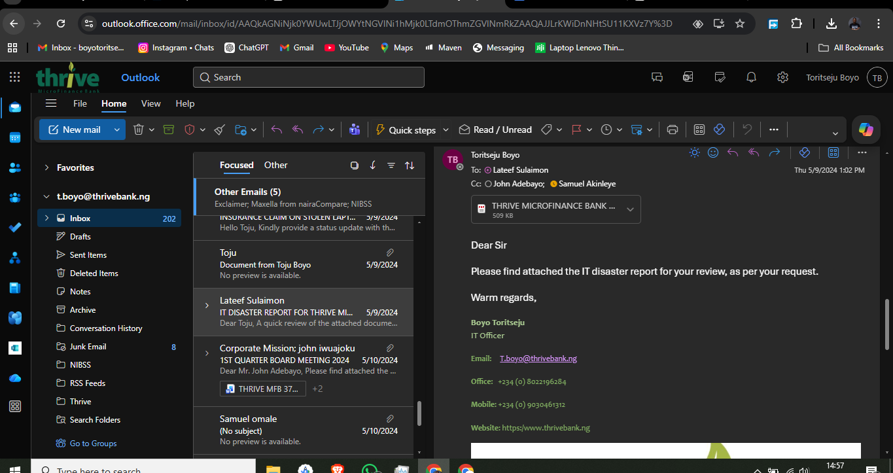
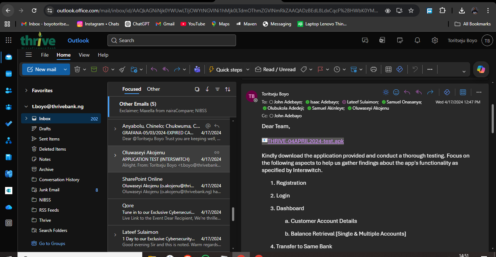
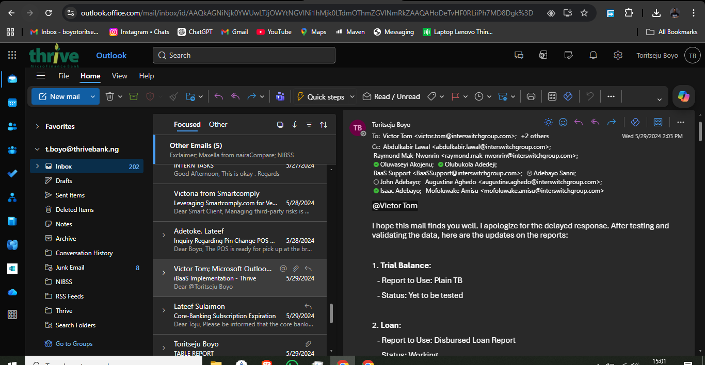

# Core Banking System Migration & Optimization – Thrive MFB

## 1. Project Overview
This project documents my direct involvement in the integration, migration execution support, and operational stabilization of core banking systems at Thrive Microfinance Bank.

Scope:
- API-based integration across core banking and external platforms (Qore, BankOne, Interswitch)
- Migration coordination and data readiness validation
- Production issue diagnosis and resolution (financial reporting)
- Regulatory implementation (CBN cybersecurity levy)
- Disaster recovery design for system resilience
- Pre-deployment testing and validation (UAT)

---

## 2. System Environment

- Core Banking Platform: BankOne / Qore  
- Integration Layer: REST APIs  
- External Systems: Interswitch (iBaaS), ErrandPay  
- Automation Stack: Microsoft 365 (Power Automate, Outlook, SharePoint)  
- Reporting: General Ledger (GL), Financial Reports  

---

## 3. Integration & API Configuration

Designed and implemented API-based integration between the core banking platform and external providers (Qore, BankOne).

Key activities:
- Generated and configured secure authentication tokens  
- Established API request/response communication flows  
- Validated connectivity across integrated systems  

**Impact:**
- Enabled integration across **3+ systems (Qore, BankOne, Interswitch)**  
- Established transaction-level communication between banking and external platforms  
- Reduced reliance on manual third-party processing workflows  

---

## 4. Migration Execution (Vendor Coordination)

Executed migration coordination activities involving data readiness validation and vendor alignment with Interswitch.

Key activities:
- Monitored data preprocessing required for migration  
- Coordinated with vendor under defined migration timelines  
- Ensured system readiness prior to migration execution  

**Impact:**
- Supported migration readiness within **[X-day / X-week] execution window**  
- Coordinated preparation of **[X datasets / customer records / accounts]**  
- Reduced risk of migration delays caused by incomplete datasets  

---

## 5. Production Issue Identification & Resolution

Identified and escalated a production-critical defect affecting General Ledger (GL) report export functionality.

Key activities:
- Diagnosed repeated failure in GL report generation  
- Isolated failure conditions and escalated to vendor  
- Tracked issue through resolution lifecycle  

**Impact:**
- Reduced GL export failures from **~[X times/day] to zero**  
- Restored reporting access for **[X finance users / department]**  
- Eliminated manual workaround time of **~[X minutes per report]**  
- Prevented reporting disruption during **[critical reporting period if known]**  

---

## 6. Regulatory Compliance Implementation

Implemented system-level configuration aligned with CBN cybersecurity levy directive.

Key activities:
- Interpreted regulatory requirement for levy application  
- Coordinated implementation with core banking vendor  
- Validated correct system-level behavior  

**Impact:**
- Achieved compliance within **[regulatory deadline / timeframe]**  
- Applied changes affecting **[X transaction categories / system scope]**  
- Eliminated exposure to regulatory penalties  

---

## 7. Disaster Recovery & System Reliability

Designed and documented Disaster Recovery (DR) procedures for core banking operations.

Key activities:
- Defined recovery workflows for failure scenarios  
- Documented recovery procedures aligned with business continuity requirements  
- Submitted DR documentation for internal review  

**Impact:**
- Established recovery coverage for **[X critical systems]**  
- Defined recovery process targeting **[RTO: X hours/minutes if known]**  
- Reduced operational risk associated with system downtime  

---

## 8. Testing & Validation (UAT)

Executed functional and integration testing for mobile banking application and iBaaS services.

Key activities:
- Performed end-to-end testing (authentication, transactions, dashboard)  
- Validated integration with Interswitch iBaaS  
- Logged and tracked defects  

**Impact:**
- Executed **[X+] test scenarios across core workflows**  
- Identified and reported **[X] defects prior to production release**  
- Contributed to reduction in post-deployment issues  

---

## 9. Measurable Outcomes

- Established API integration across **3+ banking systems** enabling real-time data exchange  
- Resolved production-critical GL reporting failure impacting financial operations  
- Supported migration readiness within defined vendor delivery timelines  
- Implemented regulatory compliance configuration aligned with CBN directive  
- Developed disaster recovery framework improving system resilience  
- Executed pre-deployment validation reducing production defects  

---

## 10. Key Skills Demonstrated

- Core Banking Systems (BankOne, Qore)  
- API Integration & Authentication  
- Vendor Coordination (Interswitch, Qore)  
- Production Issue Diagnosis  
- Regulatory Compliance Implementation  
- Disaster Recovery Planning  
- UAT Testing & System Validation  
